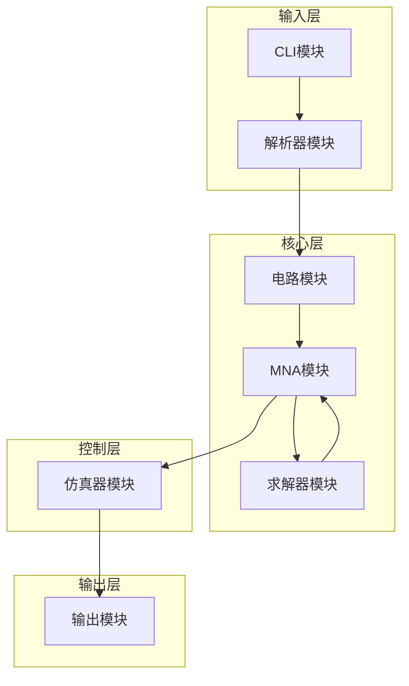

# 总体架构

## 系统概述

RustSim是一个高性能的SPICE电路仿真器，采用模块化设计架构。系统由6个核心模块组成，每个模块负责特定的功能，通过清晰的接口进行协作。

## 系统架构图



## 模块关系和数据流

### 1. CLI模块 (cli.rs)
**功能**: 命令行接口和参数处理
- 解析命令行参数
- 验证输入文件
- 配置仿真参数
- 调用其他模块

### 2. 解析器模块 (parser.rs)
**功能**: SPICE网表文件解析
- 读取和解析.sp文件
- 提取电路元件信息
- 解析分析指令
- 错误处理和恢复

### 3. 电路模块 (circuit.rs)
**功能**: 电路表示和元件建模
- 电路拓扑结构管理
- 元件类型定义和分类
- 节点和连接关系
- 电路验证

### 4. MNA模块 (mna.rs)
**功能**: 改进节点分析系统组装
- 构建线性方程组
- 处理各种元件类型
- 矩阵组装和更新
- 稀疏矩阵优化

### 5. 求解器模块 (solver.rs)
**功能**: 线性系统求解
- 多种求解算法实现
- 自动求解器选择
- 收敛性检查
- 性能优化

### 6. 仿真器模块 (simulator.rs)
**功能**: 仿真控制和编排
- 协调各模块工作
- 实现不同分析类型
- 收敛性管理
- 结果收集

### 7. 输出模块 (output.rs)
**功能**: 结果导出和统计分析
- 多格式数据导出
- 信号统计分析
- 可视化脚本生成
- 性能报告

## 核心数据结构

### 电路表示
```rust
pub struct Circuit {
    pub title: String,
    pub nodes: Vec<Node>,
    pub components: Vec<Component>,
    pub node_map: HashMap<String, usize>,
    pub ground_node: Option<usize>,
}
```

### MNA系统
```rust
pub struct MnaSystem {
    pub matrix: DMatrix<f64>,
    pub rhs: DVector<f64>,
    pub unknowns: DVector<f64>,
    pub node_map: HashMap<usize, usize>,
    pub voltage_source_map: HashMap<String, usize>,
    pub size: usize,
    pub num_nodes: usize,
    pub num_voltage_sources: usize,
}
```

### 仿真结果
```rust
pub struct SimulationResult {
    pub analysis_type: AnalysisType,
    pub time_points: Vec<f64>,
    pub node_voltages: HashMap<String, Vec<f64>>,
    pub currents: HashMap<String, Vec<f64>>,
    pub convergence_info: Vec<ConvergenceInfo>,
    pub total_time: f64,
    pub success: bool,
}
```

## 数据流分析

### 1. 输入处理流程
```
SPICE文件 → 解析器 → 电路对象 → 验证
```

### 2. 仿真执行流程
```
电路对象 → MNA系统 → 求解器 → 结果 → 输出处理
```

### 3. 瞬态分析流程
```
初始条件 → 时间步进 → 矩阵更新 → 求解 → 收敛检查 → 下一步
```

## 性能优化策略

### 1. 内存管理
- 使用Rust的所有权系统避免内存泄漏
- 稀疏矩阵存储减少内存占用
- 智能指针管理大型数据结构

### 2. 计算优化
- 稀疏矩阵运算优化
- 并行计算准备（未来扩展）
- 缓存友好的数据访问模式

### 3. 算法优化
- 自动求解器选择
- 自适应时间步长
- 收敛性加速技术

## 扩展性设计

### 1. 模块化接口
每个模块都定义了清晰的接口，便于独立开发和测试。

### 2. 插件化架构
支持新元件类型和分析方法的扩展。

### 3. 配置化设计
通过配置文件支持不同的仿真参数和算法选择。

## 错误处理策略

### 1. 分层错误处理
- 解析层：语法错误和格式错误
- 电路层：拓扑错误和参数错误
- 数值层：收敛错误和数值稳定性错误

### 2. 错误恢复机制
- 自动重试机制
- 降级策略
- 详细错误报告

## 总结

RustSim的模块化架构设计确保了系统的可维护性、可扩展性和高性能。每个模块都有明确的职责，通过标准化的接口进行协作，形成了一个完整的电路仿真系统。这种设计不仅便于开发和调试，也为未来的功能扩展奠定了坚实的基础。 